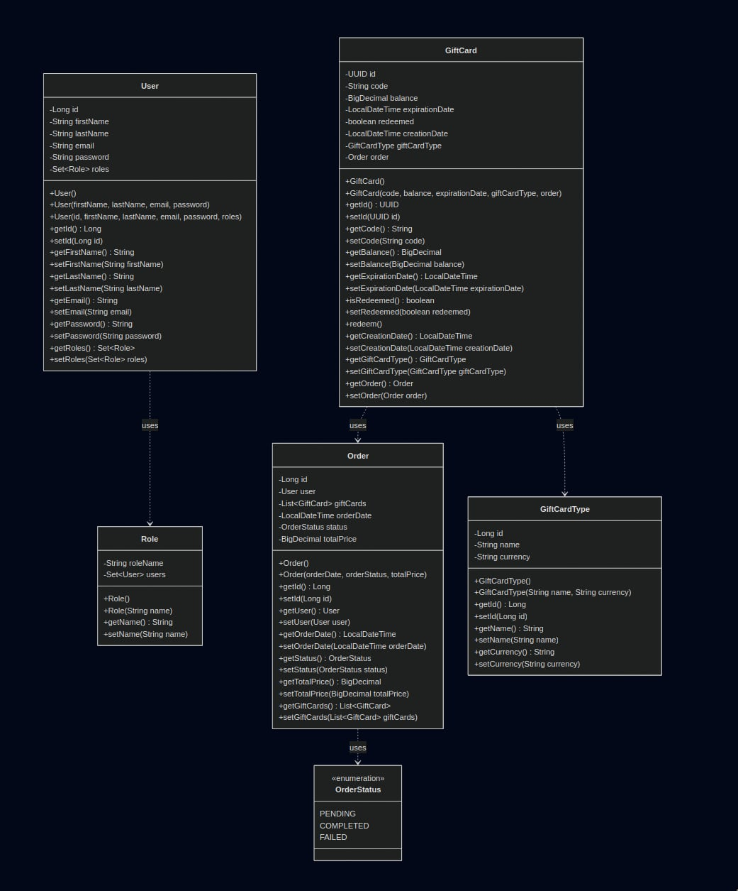
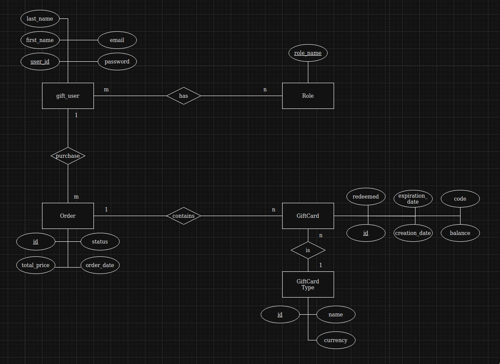

# GiftCard Service — Requirements and Use Case Design

## 1. Functional Requirements
- User registration and authentication (JWT-based)  
- User profile management (view, update, partial update)  
- Browsing available gift card types  
- Creating gift card orders (purchase)  
- Viewing user orders  
- Retrieving details of specific gift cards  
- Redeeming gift cards securely  
- Admin user management (CRUD on users)  
- Admin management of gift card types  
- Error handling and validation on all user inputs  
- Role-based access control (users vs admins)

## 2. Non-Functional Requirements
- **Scalability**: System must support increasing users and orders without performance degradation
- **High Availability**: 99.9% uptime with fault tolerance and automatic failover mechanisms
- **Security**: JWT-based authentication, encrypted passwords, secure gift card codes
- **Performance**: API response times under 200ms for standard operations
- **Data Privacy**: GDPR compliance for user information and order history protection
- **Validation**: Comprehensive input validation with detailed error responses
- **Documentation**: Complete API documentation using Swagger/OpenAPI specification
- **Monitoring**: Comprehensive logging for security audits and system monitoring
- **Data Integrity**: ACID transactions for financial operations and gift card redemptions
- **Backup & Recovery**: Automated daily backups with point-in-time recovery capabilities

## 3. Use Cases

| Use Case                  | Description                                                                                     | Actor    |
|---------------------------|-------------------------------------------------------------------------------------------------|----------|
| Register User             | New user signs up with email, password, and profile info.                                       | Customer |
| Login User                | User logs in and receives JWT token for session management.                                     | Customer |
| View/Edit Profile         | User views or updates own profile information.                                                 | Customer |
| Browse Gift Card Types    | User fetches list of available gift card types.                                                | Customer |
| Place Order              | User creates an order for one or multiple gift cards.                                          | Customer |
| View User Orders         | User views list and details of own gift card orders.                                           | Customer |
| Redeem Gift Card         | User redeems a gift card by unique identifier and updates balance/status.                       | Customer |
| Admin Manage Users       | Admin views, updates, or deletes user accounts.                                                | Admin    |
| Admin Manage Card Types  | Admin creates, updates, or deletes gift card types.                                            | Admin    |
| View Order Analytics     | Admin views system-wide order statistics and analytics.                                        | Admin    |

## 4. Objects, Classes, and Relationships

### 4.1 Core Business Objects
The system identifies the following core business objects:

**User**: Represents customers and administrators who interact with the system
- Attributes: ID, firstName, lastName, email, password, roles
- Responsibilities: Authentication, profile management, order placement

**Role**: Defines access permissions and user types
- Attributes: roleName, users
- Responsibilities: Authorization, access control

**Order**: Represents purchase transactions for gift cards
- Attributes: ID, user, giftCards, orderDate, status, totalPrice
- Responsibilities: Transaction management, order tracking

**GiftCard**: Individual gift card instances with unique codes
- Attributes: ID, code, balance, expirationDate, redeemed, creationDate, giftCardType, order
- Responsibilities: Balance tracking, redemption management, expiration handling

**GiftCardType**: Templates defining gift card categories
- Attributes: ID, name, currency
- Responsibilities: Card type definition, currency management

**OrderStatus**: Enumeration defining order states
- Values: PENDING, COMPLETED, FAILED
- Responsibilities: Order state management

### 4.2 Key Relationships
- **User ↔ Role**: Many-to-Many relationship (users can have multiple roles)
- **User → Order**: One-to-Many relationship (user can place multiple orders)
- **Order → GiftCard**: One-to-Many relationship (order can contain multiple gift cards)
- **GiftCardType → GiftCard**: One-to-Many relationship (one type can be used for multiple cards)
- **Order → OrderStatus**: Each order has one status from the enumeration

## 5. Class Diagram

## 6. CRC Cards Summary

| Class         | Responsibilities                                    | Collaborators                         |
|---------------|---------------------------------------------------|-------------------------------------|
| **User**      | Manage user authentication and profile data • Handle user registration and login • Maintain user roles and permissions | Order, GiftCard, Role               |
| **Role**      |  Define user access levels • Manage authorization permissions • Control system access | User                                |
| **Order**     |  Process purchase transactions • Track order status and history • Calculate total prices • Manage order lifecycle | User, GiftCard, OrderStatus        |
| **GiftCard**  |  Store individual gift card details • Handle redemption logic • Track balance and expiration • Generate unique codes | User, GiftCardType, Order          |
| **GiftCardType** |  Define gift card categories • Specify currency and naming • Template for gift card creation | GiftCard                         |
| **OrderStatus** |  Define valid order states • Ensure proper state transitions • Provide status validation | Order                            |

## 7. ER Diagram

